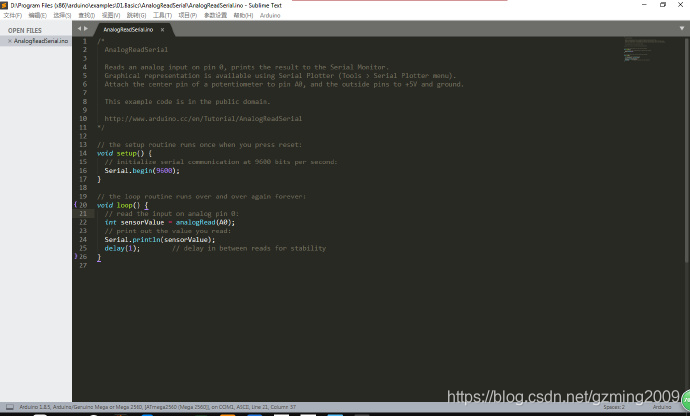

### 简介

Sublime是一款常用的代码编辑器。很多Arduino爱好者使用这个软件进行Arduino的代码编写。然而第一次使用Arduino的人在如何连接Sublime和Arduino两个软件上往往一头雾水，所以这里初琴提供一个已经打包好的Sublime + Arduino一键安装包给大家。

---

### 软件截图

---

### 功能介绍

1.无需大量设置就可以直接用Sublime进行Arduino编程。
2.集成了Arduino for STM32补丁，可以用Arduino进行STM32编程！
3.集成了Arduino Hex补丁，可以直接提取Hex文件用于烧录！
4.Sublime for Arduino是Sublime Text 3和Arduino分别在两个文件夹的版本
  Sublime for Arduino Single是合并在一个文件夹的版本

---

### 打包内容

集成Aruino 1.8.5，Ocrobot 1.6.10.0，Sublime Text 3.3176
其中包含以下功能：
1）使用Sublime编译Arduino的功能
2）Arduino for STM32
3）Arduino 生成 Hex 补丁